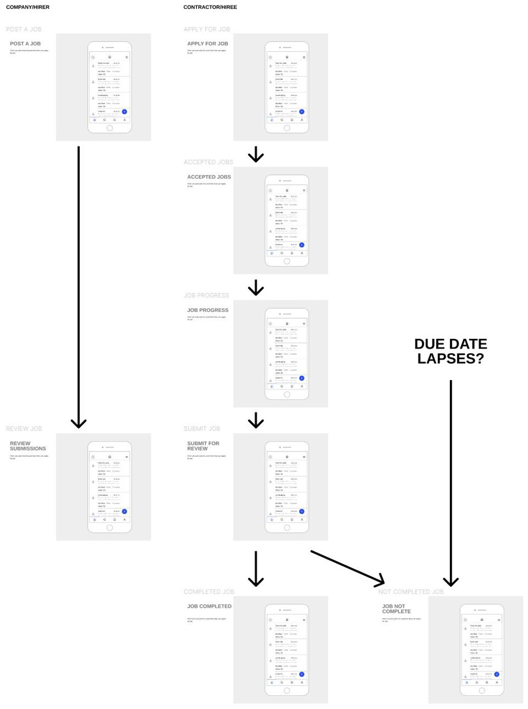

## Near Enough

dApp for sub-contractors to be paid for completed work by a timestamp issued by contractor

## Concept

This contract allows contractors to award Jobs to sub-contractors.

### Example Story

For the sake of this explanation, we'll assume two users: Alice and Bob

1. Alice wants some work completed by a due date. So she creates a new job for the **Near Enough** community to search and apply for
2. Bob is looking for work and so looks through the Jobs available on **Near Enough**
3. Bob finds a job he wants to inquire for and submits a request to undertake the job and complete it 
4. Alice reviews applicants and approves Bob to do job
5. Bob goes ahead and does the job and submits his progress for approval by Alice
6. Alice, as the job owner, approves the finished work and funds are released to Bob
7. Otherwise the due date for the job lapses and the job is void giving Alice the chance to let another contractor apply for it or to remove the job from **Near Enough** 


- [Getting Started](#getting-started)
  - [Installation](#installation)
  - [Commands](#commands)
- [UI Workflow](#ui-workflow)
- [File Structure](#file-structure)
- [Contracts](#contracts)
- [Deploying](#deploying)
- [Future Development](#future-development)
- [Key Contributors](#key-contributors)

---
## Getting Started

This repository makes use of the following:

- One or more [smart contracts](https://docs.near.org/docs/roles/developer/contracts/intro)
- [Unit tests](https://docs.near.org/docs/roles/developer/contracts/test-contracts#unit-tests) and [simulation tests](https://docs.near.org/docs/roles/developer/contracts/test-contracts#simulation-tests) for the contract(s)
- Wireframes and/or mockups for a potential dApp UI
- Utilities for building, testing, and deploying contracts (facilitated by the [NEAR CLI](https://docs.near.org/docs/development/near-cli))

### Installation

1. clone this repo
2. run `cargo test -- --nocapture`
3. explore the contents of `src/`

See below for more convenience scripts ...

### Commands

**Run unit tests**

```sh
yarn test:unit                # asp --verbose --nologo -f unit.spec
```

**Run simulation tests**

These tests can be run from within VSCode (or any Rust-compatible IDE) or from the command line.

```sh
yarn test:simulate            # yarn build:release && cargo test -- --nocapture
```

**Run all tests**

```sh
yarn test                     # yarn test:unit && test:simulate
```

## UI workflow

**UI Workflow**



## File Structure

This contract is designed to be self-contained and so may be extracted into your own projects and used as a starting point.  If you do decide to use this code, please pay close attention to all top level files including:

- Rust artifacts
  - `Cargo.toml`: Rust project dependencies and configuration
  - `Cargo.lock`: version-locked list of Rust project dependencies

The core file structure:

```
near-enough
├── README.md                           <-- this file
├── Cargo.toml                          <-- config
├── build                               <-- compiled contracts (WASM)
│   ├── debug
│   └── release
├── simulation
│   └── lib.rs                          <-- simulation tests
├── src
│   └── lb.rs                           <--   contract source code
└── wireframes                          <-- wireframe images
```

### Future Development

Some ideas for future feature development:

- Automate approval of submissions based on ability to complete past jobs. Reputation score perhaps

### Key Contributors

- [Simon Palmer - @simondpalmer](https://github.com/simondpalmer)